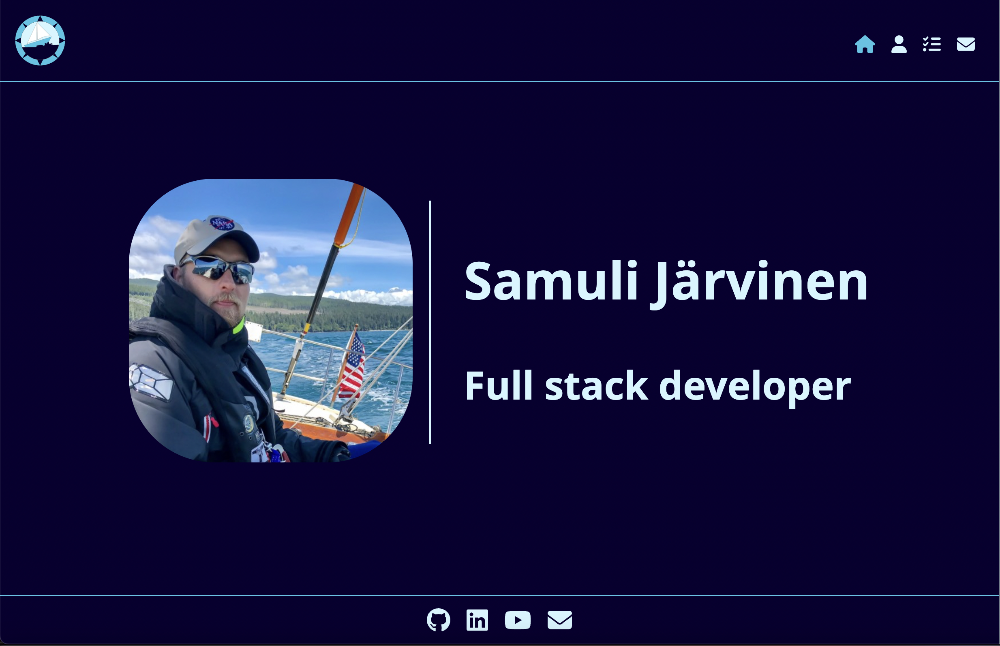

# React Portfolio

## Description
This is a remake of the previous portfolio using React with animate.css, validator, fortawesome icons and gh-pages for deployment. 
It functions as a showcase of the skills learned so far in the full-stack developer class.

## License
[](https://opensource.org/licenses/MIT)

## Table of contents
- [Description](#description)
- [License](#license)
- [Installation](#installation)
- [How to use](#how-to-use)
- [More information](#more-information)

## Installation
- Clone the repo
- run ```npm install```
- run ```npm start``` to launch the application and a connected browser

## How to use
After launching the application a browser window should have opened. This will contain the single page react application.
If this did not happen open your broser and point it to the URL displayed on console after executing ```npm start```.

See the screenshot below for a teaser:


You can also visit the deployed application on my [GitHub pages](https://frye.github.io/react-portfolio).

## More information:
- Through GitHub: [@frye](https://github.com/frye)
- Via Email: psjcode@gmail.com